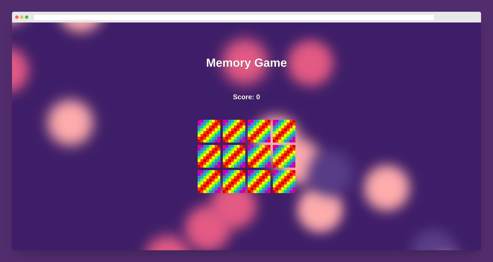

# 🃏 Memory Game

## 📝 Description

The Memory Game is a classic card game where players try to match pairs of cards with the same design. In this project, I built a JavaScript-based memory game that can be played in the browser. No packages needed.

----

## Screenshot 📷

Preview of the game

----

## 🚀 Features

- The game board consists of 16 cards with 8 different designs, so there are 8 pairs of matching cards. 🃏🃏🃏🃏🃏🃏🃏🃏
- The deck of cards is randomized each time the game is played, so the player faces a new challenge every time. 🔀🎲
- The gameplay consists of flipping over pairs of cards to reveal their underlying design, and determining whether they match or not. 🤔🔎
- If the cards match, they will remain face up. If they don't match, they will flip back over. 🔄
- The game ends once all cards have been correctly matched, and a message is displayed letting the player know how long it took to complete the game. 🎉🕒

----

## 🛠️ Technologies Used

- HTML
- CSS
- JavaScript

----

## 🎮 Get Started

To start playing the Memory Game, simply clone the repository and open index.html in your preferred web browser. 🌐

----

## 🙏 Acknowledgments

- Images generated with [Leonardo.ai](https://leonardo.ai)
- Dynamic background created with [wweb.dev](https://wweb.dev/resources/animated-css-background-generator)

## Feel free to use and modify this code as you want to 💥